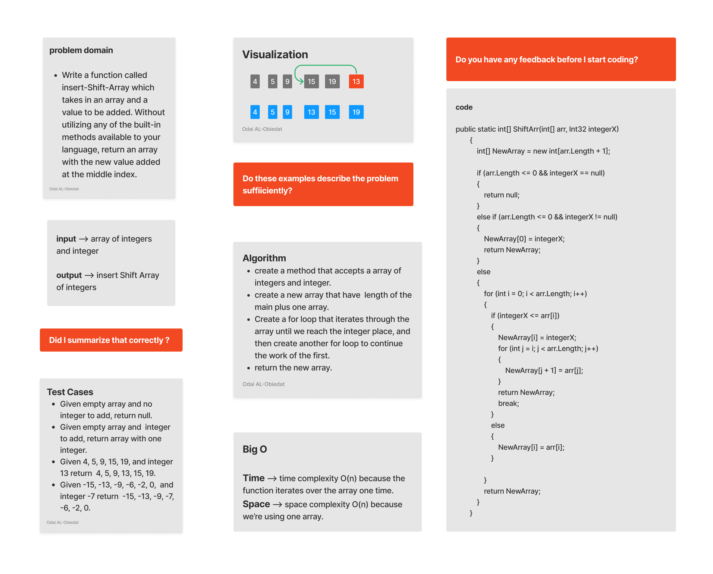

### Challenege 2 - Insert and Shift Array

#### Challenge
Write a function called insertShiftArray which takes in an array and a value to be added. Without utilizing any of the built-in methods available to your language, return an array with the new value added at the middle index.

#### Solution
*[Solution](https://github.com/Ody950/data-structures-and-algorithms/blob/main/CodeChallenges/Code.Challenges2.cs)*

*[Unit Test codecha-2](https://github.com/Ody950/data-structures-and-algorithms/blob/main/CodeChallengesTests/CodeChallenge-2-Tests.cs)*
