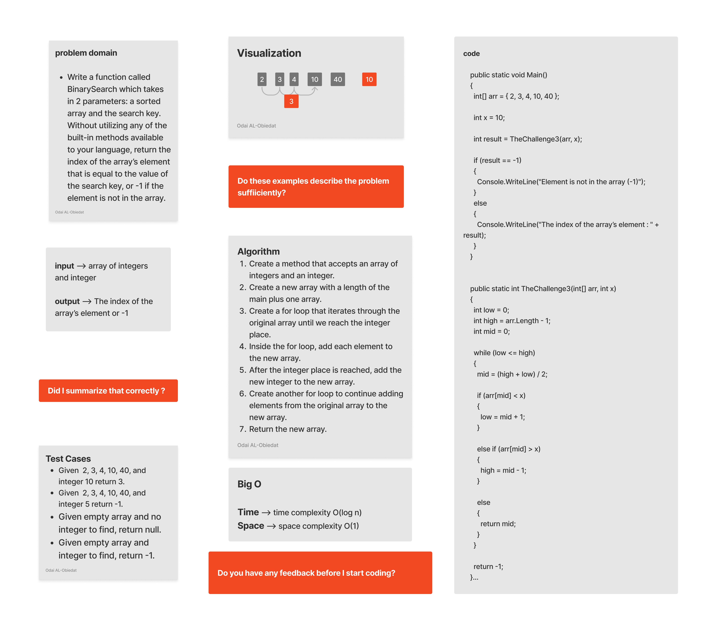

### Challenege 3 - Binary Search
#### Challenge
Write a function called BinarySearch which takes in 2 parameters: a sorted array and the search key. Without utilizing any of the built-in methods available to your language, return the index of the array’s element that is equal to the value of the search key, or -1 if the element is not in the array.
#### Solution
*[Solution](https://github.com/Ody950/data-structures-and-algorithms/blob/main/CodeChallenges/Code.Challenges3.cs)*

*[Unit Test codecha-3]https://github.com/Ody950/data-structures-and-algorithms/blob/main/CodeChallengesTests/CodeChallenge-3-Tests.cs)*

