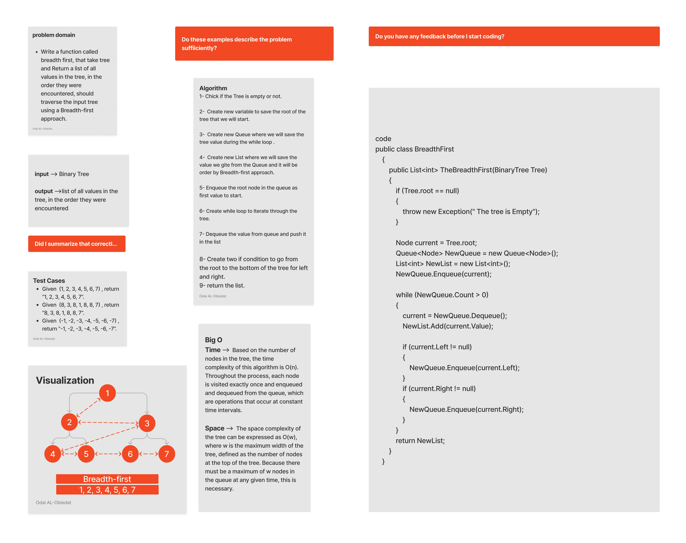

# Tree breadth first

#### Solution
*[Solution- Tree breadth first](https://github.com/Ody950/data-structures-and-algorithms/blob/main/DataStructures/DataStructures/Trees/BreadthFirst.cs)*

#### Unit Test
*[Unit Test- Tree breadth first](https://github.com/Ody950/data-structures-and-algorithms/blob/main/DataStructures/DataStructuresTests/BreadthFirstTest.cs)*

Trees are a powerful data structure with many applications. Trees are used in computer science for various tasks, including storing information, representing hierarchical data, and providing efficient algorithms for operations such as insertion, deletion, and searching.

## Challenge

### Write a function called breadth first

-Write a function called breadth first, that take tree and Return a list of all values in the tree, in the order they were encountered, should traverse the input tree using a Breadth-first approach.

### Implementing:

- Tree breadth first

## Approach & Efficiency

### Trees max

- Time : Based on the number of nodes in the tree, the time complexity of this algorithm is O(n). Throughout the process, each node is visited exactly once and enqueued and dequeued from the queue, which are operations that occur at constant time intervals.

- Space : The space complexity of the tree can be expressed as O(w), where w is the maximum width of the tree, defined as the number of nodes at the top of the tree. Because there must be a maximum of w nodes in the queue at any given time, this is necessary.

# Whiteboard

## Tree breadth first

