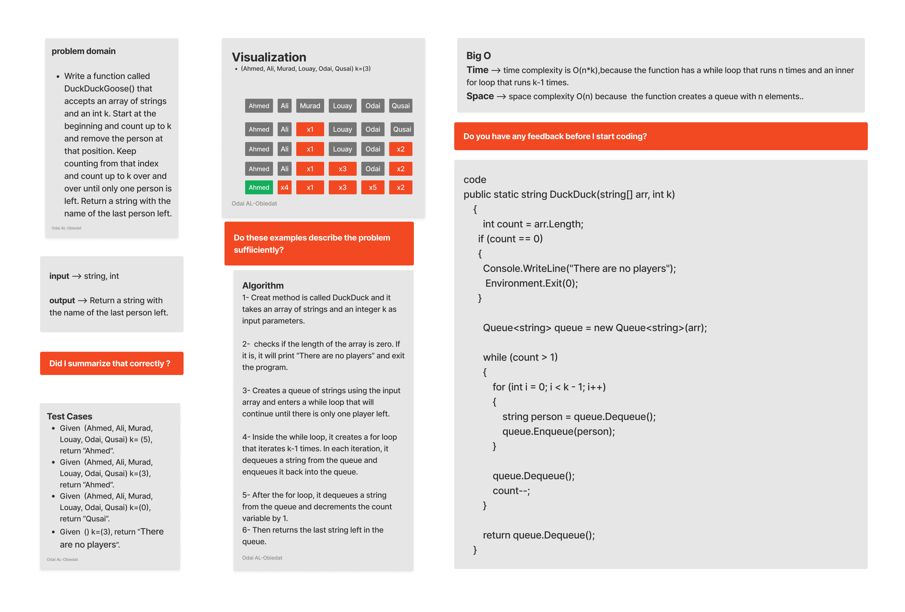

# Duck Duck Goose

## Duck Duck Goose

Write a function called DuckDuckGoose() that accepts an array of strings and an int k. Start at the beginning and count up to k and remove the person at that position. Keep counting from that index and count up to k over and over until only one person is left. Return a string with the name of the last person left.

# Approach & Efficiency (BigO)

Time --> time complexity is O(n*k),because the function has a while loop that runs n times and an inner for loop that runs k-1 times.

Space --> space complexity O(n) because  the function creates a queue with n elements..

# Whiteboard

## Queue Pseudo

