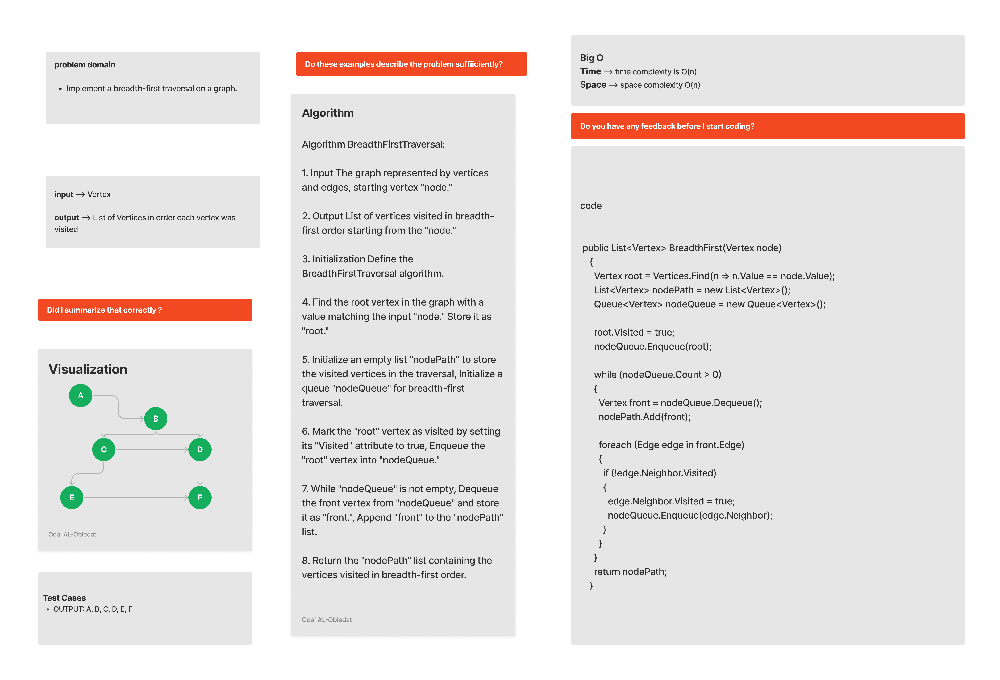

# Graph-Breadth-First
When a dead end occurs during any one of the iterations, the Breadth First Search (BFS) algorithm will remember to obtain the next vertex to begin a search, using a queue.

#### Solution
*[Solution- Graph-Breadth-FirstTest](https://github.com/Ody950/data-structures-and-algorithms/blob/main/DataStructures/DataStructures/Graph-Breadth-First)*

#### Unit Test
*[Unit Test- Graph-Breadth-FirstTest](https://github.com/Ody950/data-structures-and-algorithms/blob/main/DataStructures/DataStructuresTests/Graph-Breadth-FirstTest.cs)*

## Challenge
Extend your graph object with a breadth-first traversal method that accepts a starting node. Without utilizing any of the built-in methods available to your language, return a collection of nodes in the order they were visited. Display the collection.

## Approach & Efficiency
* Big O Space = O(n)
* Big O Time = O(n)

# Whiteboard

