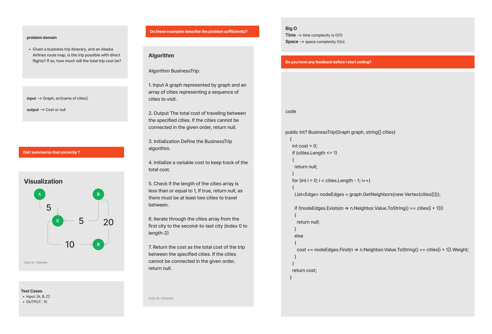

# Graph-Business-Trip
This application finds a direct path between all nodes in the sequence of the array given a graph of city nodes and a string array of city names, and if it can, it calculates the sum of the costs between each node.

#### Solution
*[Solution- Graph-Business-Trip](https://github.com/Ody950/data-structures-and-algorithms/blob/main/DataStructures/DataStructures/Graph-Business-Trip)*

#### Unit Test
*[Unit Test- Graph-Business-Trip](https://github.com/Ody950/data-structures-and-algorithms/blob/main/DataStructures/DataStructuresTests/graph-business-tripTest.cs)*

## Challenge
Write a function called business trip, take graph and array of city names, return the cost of the trip (if it’s possible) or null (if not)

## Approach & Efficiency
* Big O Space = O(1)
* Big O Time = O(n)

# Whiteboard

