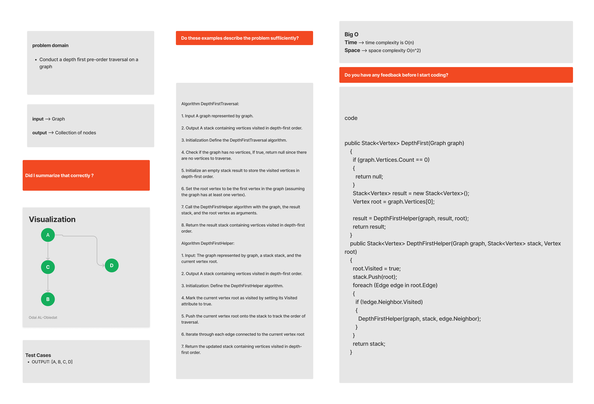

# Graph-Depth-First
Data structures such as tree trees and graphs are traversed or searched using depth-first search (DFS). Initially, the algorithm starts at the root node (in the case of a graph, any arbitrary node is selected as the root node) and explores each branch as far as possible before going back to the root node.
#### Solution
*[Solution- Graph-Depth-First](https://github.com/Ody950/data-structures-and-algorithms/blob/main/DataStructures/DataStructures/Graph-Depth-First)*

#### Unit Test
*[Unit Test- Graph-Depth-First](https://github.com/Ody950/data-structures-and-algorithms/blob/main/DataStructures/DataStructuresTests/Graph-Depth-FirstTest.cs)*

## Challenge
Write method Name Depthfirst take Node (Starting point of search) and return a collection of nodes in their pre-order depth-first traversal order.

## Approach & Efficiency
* Big O Space = O(n^2)
* Big O Time = O(n)

# Whiteboard

