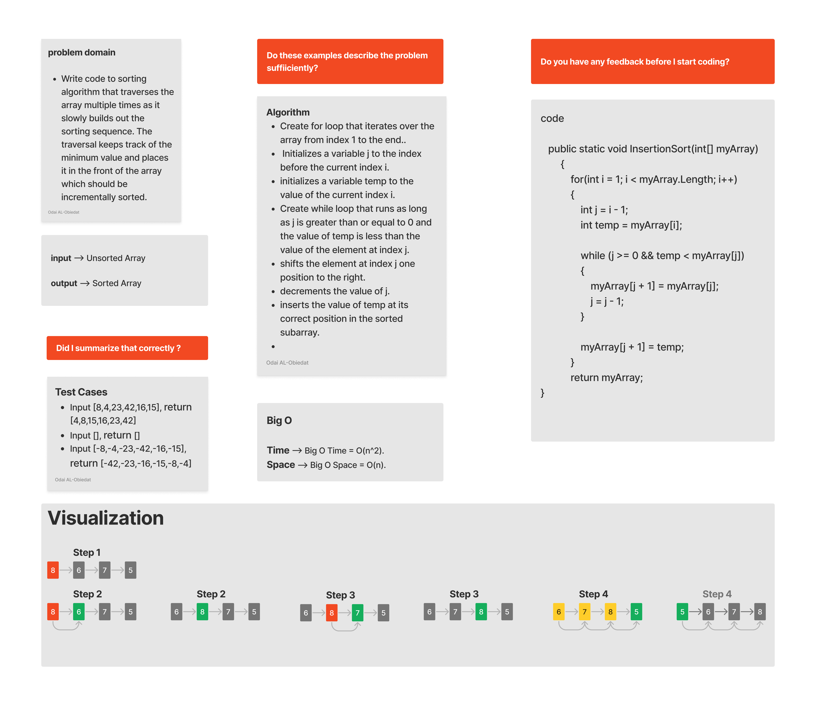

# Insertion Sort

#### Solution
*[Solution- Insertion Sort](https://github.com/Ody950/data-structures-and-algorithms/blob/main/DataStructures/DataStructures/InsertionSort.cs)*

## Description

Write code to sorting algorithm that traverses the array multiple times as it slowly builds out the sorting sequence. The traversal keeps track of the minimum value and places it in the front of the array which should be incrementally sorted.

# Approach & Efficiency (BigO)

Time --> Big O Time = O(n^2).

Space --> Big O Space = O(n).

# Whiteboard

## Insertion Sort

- Pass 01:

In the first pass of the insertion sort we set the temp, which is 6, and compare it with the previous element in the array, which is 8.
Since 8 is greater than 6, we move the element 8 to be in the next position and insert the key 6 into the previous position.

- Pass 02:

The second pass through the array we set the temp, which is 7, and compare it with the previous element in the array, which is 8.

Since 8 is greater than 7, we move the element 8 to be in the next position and insert the key 7 into the previous position.

- Pass 03:

The third pass through the array we set temp to be 5, and compare it with its previous element in the array, which is 8.
Since 8 is greater than 5, we insert it into its correct position before element 8.
We then compare 5 with 6, since 5 is less than 6, we insert it into its correct position before 6.
We then compare 5 with 7, since 5 is less than 7, we insert it into its correct position before 7.
We then compare 5 with 8, since 5 is less than 8, we insert it into its correct position before 8.
