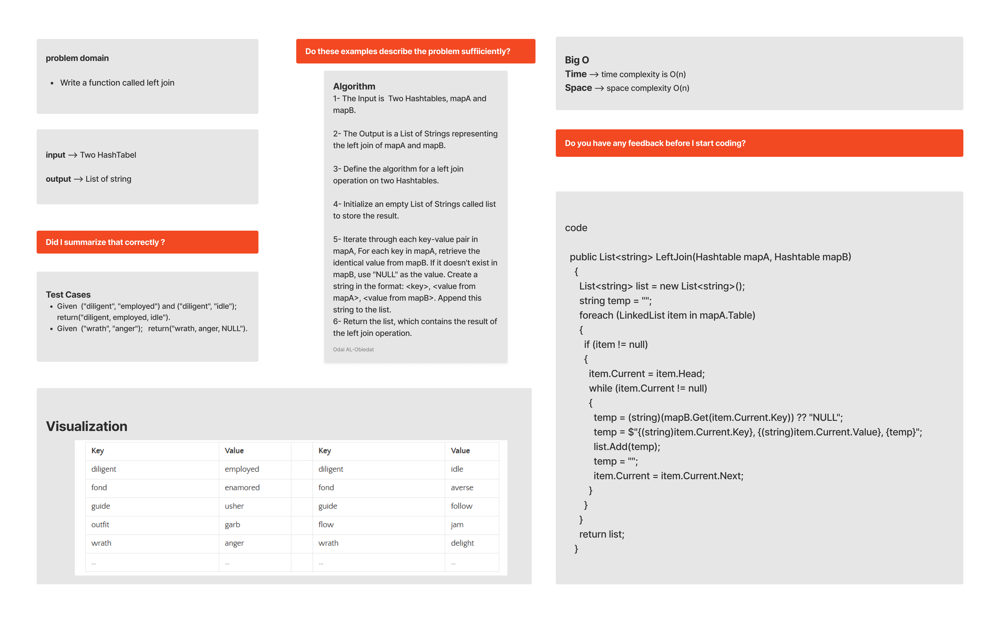
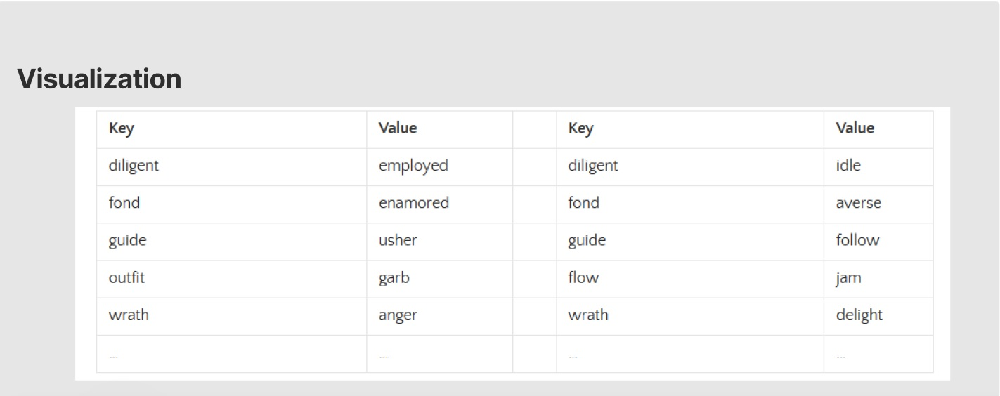

# Left Join

The LEFT JOIN uses a common column in two tables to combine rows from both tables. This involves merging the rows from the left table (the first table) with the matching rows from the right table (the second table). A NULL value is assigned to a column in the right table if there is no match in the right table.

#### Solution
*[Solution- Left-Join](https://github.com/Ody950/data-structures-and-algorithms/blob/main/DataStructures/DataStructures/Left-Join)*

#### Unit Test
*[Unit Test- Left-Join](https://github.com/Ody950/data-structures-and-algorithms/blob/main/DataStructures/DataStructuresTests/Left-JoinTest.cs)*

## Challenge

- Write a function called left join
- Arguments: two hash maps
- The first parameter is a hashmap that has word strings as keys, and a synonym of the key as values.
- The second parameter is a hashmap that has word strings as keys, and antonyms of the key as values.
- Return: The returned data structure that holds the results is up to you. It doesn’t need to exactly match the output below, so long as it achieves the LEFT JOIN logic

# Whiteboard

## Approach & Efficiency

Implemented a method that takes a Hashtable1 (synonym) and Hashtable2 (antonym) hashtable as inputs. In the next step, the method searches for keys in the Hashtable1. Once a key has been identified, the word as well as its Hashtable1 are added to a string. It is then checked whether the key exists in Hashtable2. When this occurs, the Hashtable2 is appended to the string. In the following step, the string is added to a list. This method returns the list when it reaches the end of the hashtable.

### Big O Time: O(n)

### Big O Space: O(n)

