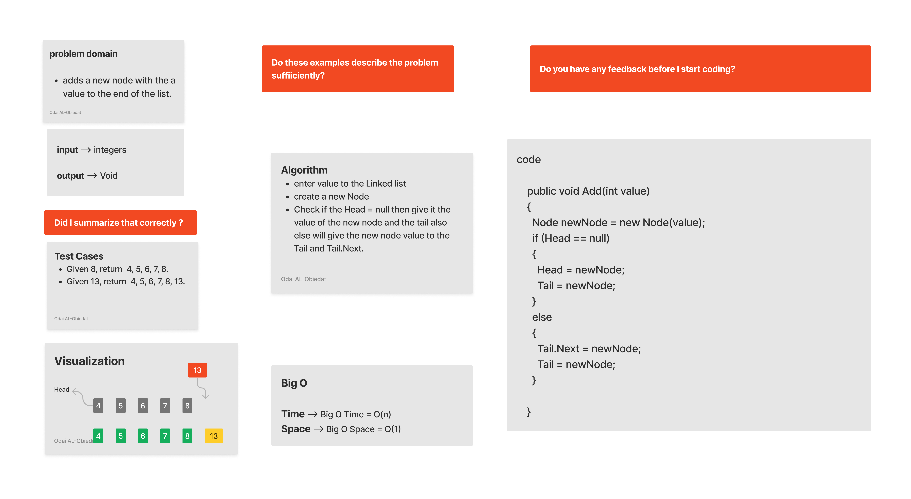

## Data Structures 1 - LinkedList
### Singly Linked List
#### ***Description***
This program creates a Linked List, and then allows you to interact with it, by performing basic operations on it, such as adding a new node based on the position or on the data that the node contains, whether before or after a specific node, as well as searching for specific data within the Linked List as well as printing the entire Linked List.
#### Solution
*[Solution-Linked List.cs](https://github.com/Ody950/data-structures-and-algorithms/blob/main/CodeChallenges/Code.Challenges3.cs)*

## LinkedList Challenge Summary

- Add method : Adds a new Node at the end of the Linked List. Big O Time = O(n), Big O Space = O(1).

- Insert method: Adds a new Node to the Linked List. Big O Time = O(1), Big O Space = O(1).

- InsertBefore: Adds a new Node into the Linked List before the first Node containing a given value, Big O Time = O(n), Big O Space = O(1).

- InsertAfter:	Adds a new Node into the Linked List after the first Node containing a given value, Big O Time = O(n), Big O Space = O(1).

- Includes: 	search in a value and returns a boolean if the value is in the Linked List, Big O Time = O(n), Big O Space = O(1).

- InsertAt: Adds a new Node into the Linked List after the  Node in the position, Big O Time = O(n), Big O Space = O(1).

- ToString:  print the collecation for all the element inside the linked list.
## Whiteboard

### Add method

### Insert method

### InsertBefore method

### InsertAfter method

*[Unit Test-Linked List.cs](https://github.com/Ody950/data-structures-and-algorithms/blob/main/CodeChallengesTests/CodeChallenge-3-Tests.cs)*

