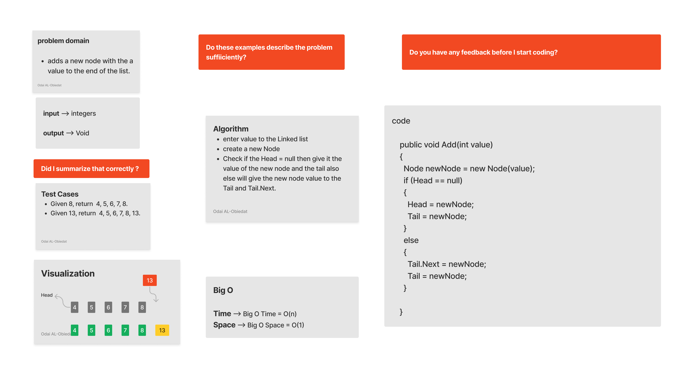
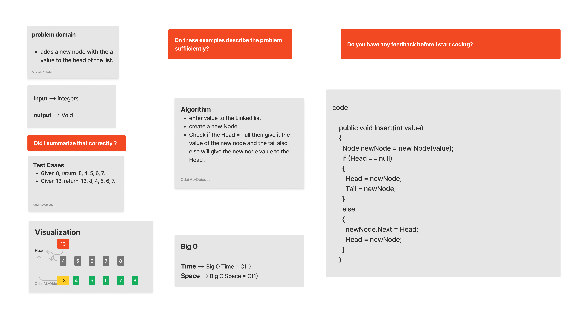
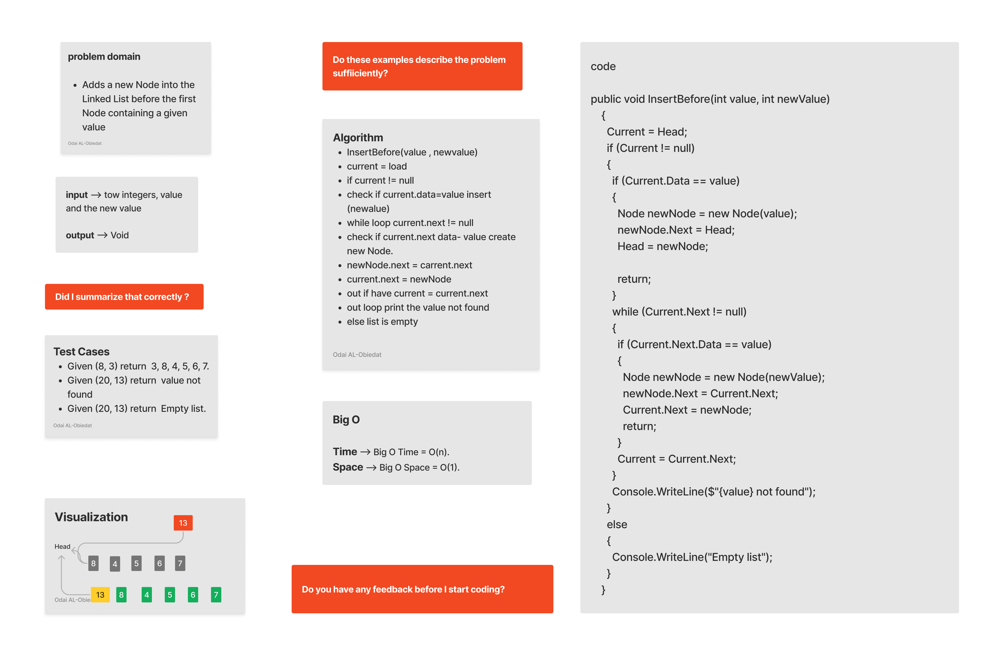
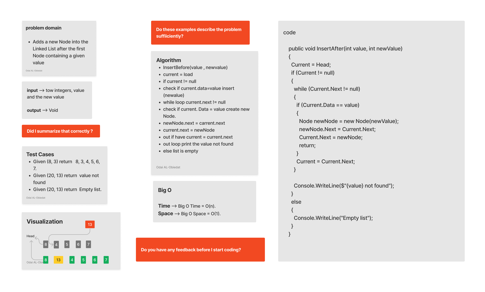
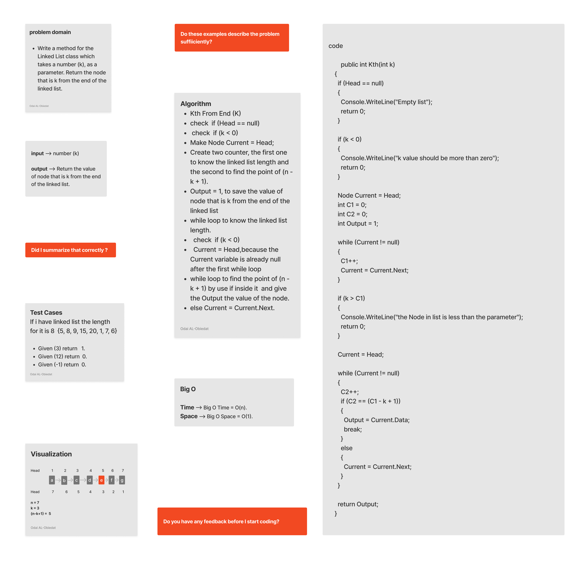

## Data Structures  - LinkedList
### Linked List kth FromEnd
#### ***Description***
Write a method for the Linked List class which takes a number (k), as a parameter. Return the node that is k from the end of the linked list.
#### Solution
*[Solution-Linked List insertions](https://github.com/Ody950/data-structures-and-algorithms/blob/main/DataStructures/DataStructures/LinkedListKth.cs)*

## LinkedList Challenge Summary

- Append method : Adds a new Node at the end of the Linked List. Big O Time = O(n), Big O Space = O(1).

- Insert method: Adds a new Node to the Linked List. Big O Time = O(1), Big O Space = O(1).

- InsertBefore: Adds a new Node into the Linked List before the first Node containing a given value, Big O Time = O(n), Big O Space = O(1).

- InsertAfter:	Adds a new Node into the Linked List after the first Node containing a given value, Big O Time = O(n), Big O Space = O(1).

- Includes: 	search in a value and returns a boolean if the value is in the Linked List, Big O Time = O(n), Big O Space = O(1).

- InsertAt: Adds a new Node into the Linked List after the  Node in the position, Big O Time = O(n), Big O Space = O(1).

- kth FromEnd:  k-th value from the end of a linked list, Big O Time = O(n), Big O Space = O(1).

## Whiteboard

### Append method

### Insert method

### InsertBefore method

### InsertAfter method

### kth FromEnd method

*[Unit Test-Linked List insertions](https://github.com/Ody950/data-structures-and-algorithms/blob/main/DataStructures/DataStructuresTests/LinkedListKthTest.cs)*

