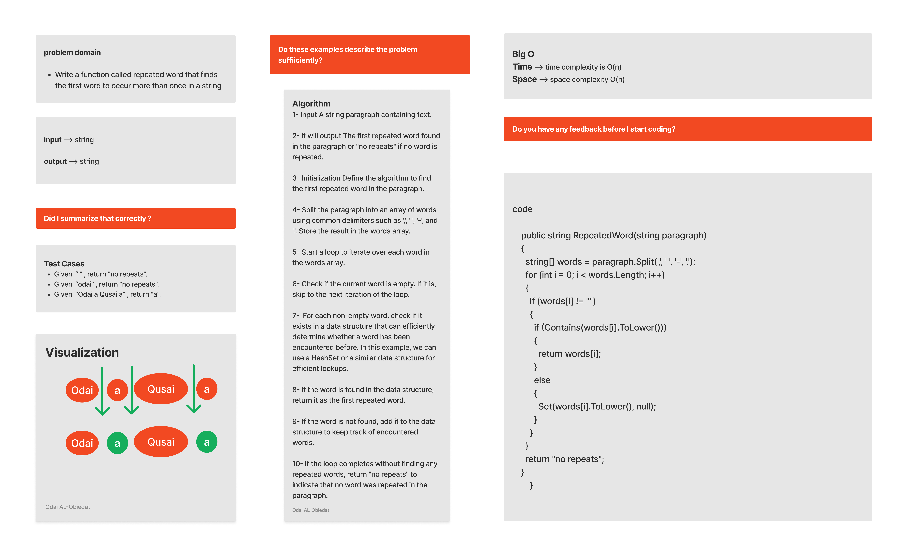

# RepeatedWord

 repeated word that finds the first word to occur more than once in a string

#### Solution
*[Solution- RepeatedWord](https://github.com/Ody950/data-structures-and-algorithms/blob/main/DataStructures/DataStructures/RepeatedWord)*

#### Unit Test
*[Unit Test- RepeatedWord](https://github.com/Ody950/data-structures-and-algorithms/blob/main/DataStructures/DataStructuresTests/RepeatedWordTest.cs)*

## Challenge

Write a function called repeated word that finds the first word to occur more than once in a string

# Whiteboard

## Approach & Efficiency

Input A string paragraph containing text,  It will output The first repeated word found in the paragraph or "no repeats" if no word is repeated, Initialization Define the algorithm to find the first repeated word in the paragraph, Split the paragraph into an array of words using common delimiters such as ',', ' ', '-', and '.'. Store the result in the words array, Start a loop to iterate over each word in the words array,  Check if the current word is empty . If it is, skip to the next iteration of the loop, For each non-empty word, check if it exists in a data structure that can efficiently determine whether a word has been encountered before. In this example, we can use a HashSet or a similar data structure for efficient lookups, If the word is found in the data structure, return it as the first repeated word, If the word is not found, add it to the data structure to keep track of encountered words, If the loop completes without finding any repeated words, return "no repeats" to indicate that no word was repeated in the paragraph.

### Big O Time: O(n)

### Big O Space: O(n)

