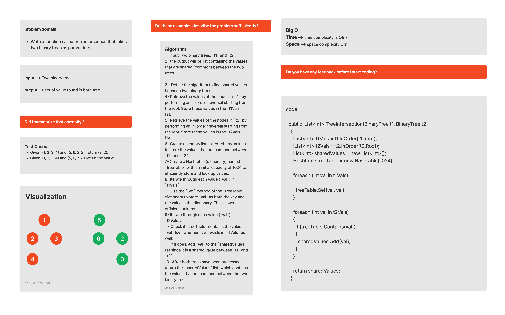

# Tree Intersection

A hash table is a data structure that stores data in an organized way using unique index values in an array format. This allows for fast data access if you know the specific index of the data you're looking for. In essence, it's a data structure where adding and finding data is quick, regardless of how much data you have. Hash tables use arrays for storage and employ a hashing technique to determine where to insert or find elements.

#### Solution
*[Solution- TreeIntersection](https://github.com/Ody950/data-structures-and-algorithms/blob/main/DataStructures/DataStructures/TreeIntersection)*

#### Unit Test
*[Unit Test- TreeIntersection](https://github.com/Ody950/data-structures-and-algorithms/blob/main/DataStructures/DataStructuresTests/TreeIntersectionTest.cs)*

## Challenge
Write a function called tree_intersection that takes two binary trees as parameters.

# Whiteboard

## Approach & Efficiency

My approach to this challenge was to first perform an InOrder traversal of both binary trees. The function returns a list of the values in each tree. Afterwards, the values of one tree are added to a hash table. The hash table is then checked to determine whether it contains the values of the second binary tree. In such a case, the value will be added to a list. Following this, a list of common values is returned.

### Big O Time: O(n)

### Big O Space: O(n)
