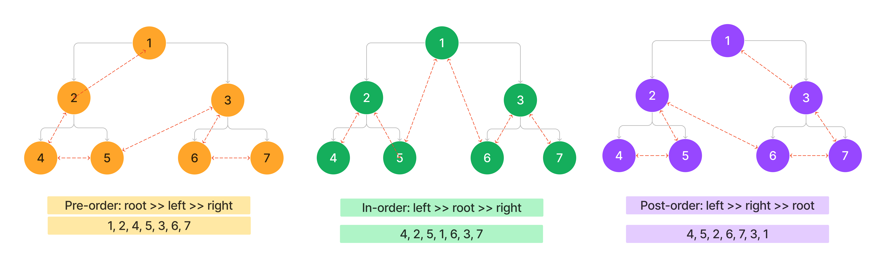

# Trees

#### Solution
*[Solution- Trees](https://github.com/Ody950/data-structures-and-algorithms/blob/main/DataStructures/DataStructures/Trees)*

#### Unit Test
*[Unit Test- Trees](https://github.com/Ody950/data-structures-and-algorithms/blob/main/DataStructures/DataStructuresTests/TreesTest.cs)*

Trees are a powerful data structure with many applications. Trees are used in computer science for various tasks, including storing information, representing hierarchical data, and providing efficient algorithms for operations such as insertion, deletion, and searching.

## Challenge

### Implementing:

- Binary Tree : Depth-First-traversals (PreOrder, InOrder, PostOrder)

- Binary Search Tree : Add & Contains

## Approach & Efficiency

### Binary Tree
Depth-First-traversals: PreOrder, InOrder, PostOrder

- Time O(N)
- Space O(1)

### Binary Search Tree:

Rules of a binary search tree:
- Each node has a key (or value) and at most two children123.
- The left child of a node has a key that is less than or equal to the key of the node4123.
- The right child of a node has a key that is greater than the key of the node4123.
- The subtrees of each node are also binary search trees2.

#### Time
- Avarage: O(Logn)
- Worst: O(N)

#### Space: O(1)

