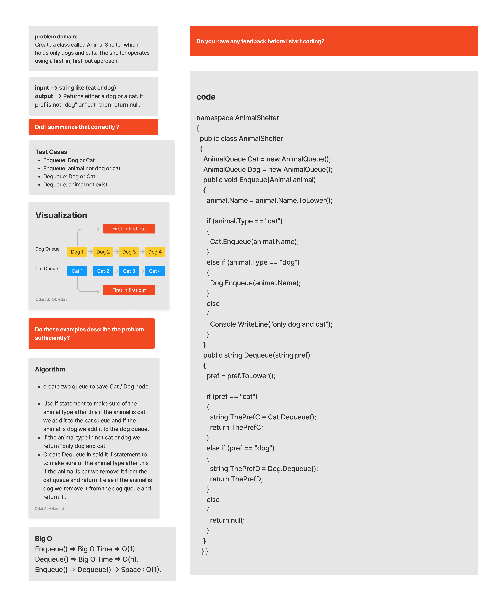

# Animal Shelter

#### Solution
*[Solution- Animal Shelter](https://github.com/Ody950/data-structures-and-algorithms/blob/main/DataStructures/DataStructures/stack-queue-animal-shelter)*

#### Unit Test
*[Unit Test- Animal Shelter](https://github.com/Ody950/data-structures-and-algorithms/blob/main/DataStructures/DataStructuresTests/stack-queue-animal-shelterTest.cs)*

## First-in, First out Animal Shelter

Create a class called Animal Shelter which holds only dogs and cats. The shelter operates using a first-in, first-out approach.

### Implement the following methods:

Enqueue(animal): adds animal (Cat/Dog) to the shelter. The animal can be either a dog or a cat object.
Dequeue(pref): Remove animal (Cat/Dog) from the shelter. Returns either a dog or a cat. If pref is not "dog" or "cat" then return null.

# Approach & Efficiency (BigO)

Enqueue() =>  Big O Time => O(1).

Dequeue() => Big O Time => O(n).

Enqueue() => Dequeue() => Space : O(1).

# Whiteboard

## Queue Pseudo

