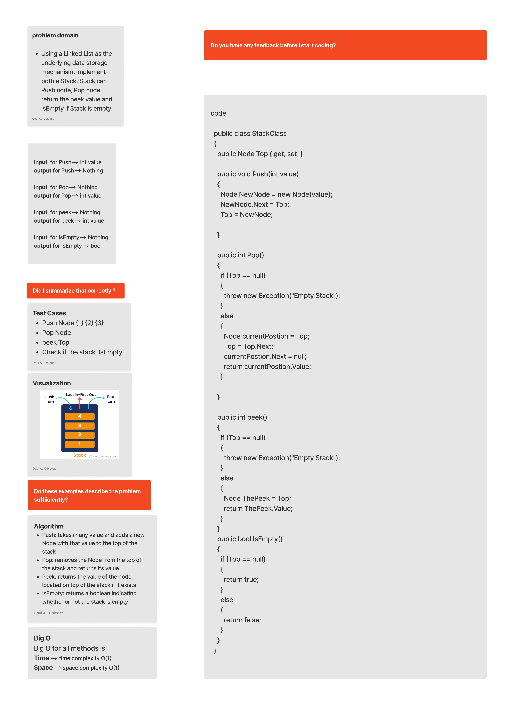
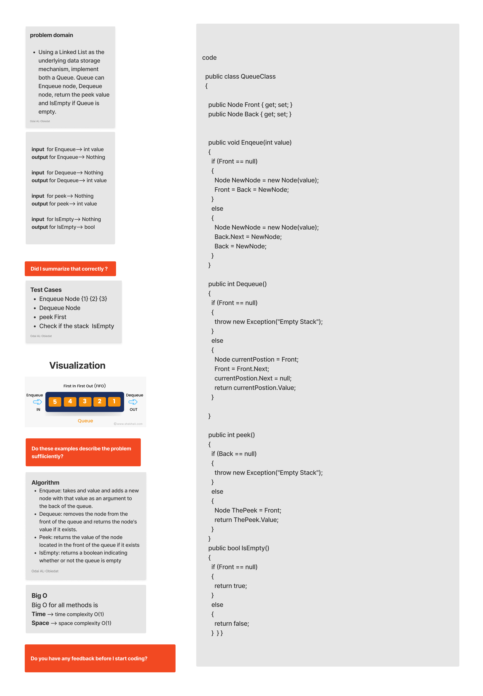

# Queue and Stacks

#### Solution
*[Solution- Stack And Queue](https://github.com/Ody950/data-structures-and-algorithms/blob/main/DataStructures/DataStructures/stack_and_queue)*

#### Unit Test
*[Unit Test- Stack And Queue](https://github.com/Ody950/data-structures-and-algorithms/blob/main/DataStructures/DataStructuresTests/Stack_and_queue_Test.cs)*
## Stacks

Stacks are data structures made up of nodes. The next Node in the stack is referenced by each Node, but the previous Node is not referenced by any Node, and its LIFO.

- LIFO  : Last In First Out and it means that the Last item added to the stack will be the First item to be popped out of it.

## Queue
Queues are linear structures in which operations follow a defined sequence, and its FIFO.

- FIFO: First In First Out and it means that the First item added to the stack will be the First item to be popped out of it.

# Challenge

 Using a Linked List as the underlying data storage mechanism, implement both a Stack and a Queue.

 - Stack can Push node, Pop node, return the peek value and IsEmpty if Stack is empty.
 - Queue can Enqueue node, Dequeue node, return the peek value and IsEmpty if Queue is empty.

# Approach & Efficiency (BigO)
Queue and Stacks have the same BigO for all the methods for Time and Space BigO.

Push O(1), Pop O(1), Peek O(1), IsEmpty O(1), Enqueue O(1), Dequeue O(1), Peek O(1), IsEmpty O(1)

# Whiteboard

## Stacks

## Queue

