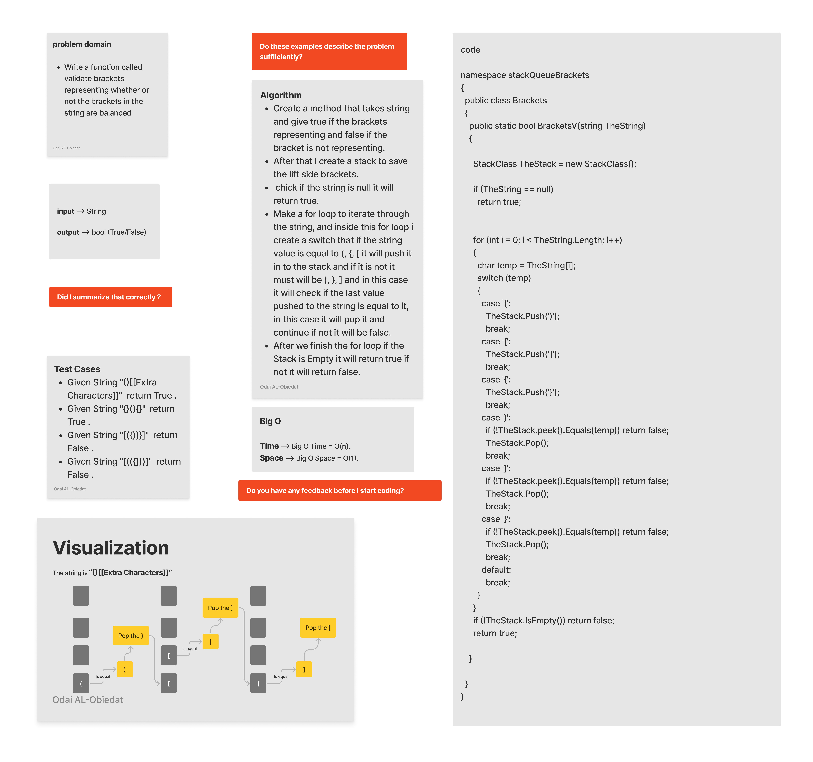

# Stack Queue Brackets

#### Solution
*[Solution- Stack Queue Brackets](https://github.com/Ody950/data-structures-and-algorithms/blob/main/DataStructures/DataStructures/stack_queue_brackets)*

#### Unit Test
*[Unit Test- Stack Queue Brackets](https://github.com/Ody950/data-structures-and-algorithms/blob/main/DataStructures/DataStructuresTests/stack_queue_brackets_Test.cs)*

## Challenge

Write a function called validate brackets representing whether or not the brackets in the string are balanced

### There are 3 types of brackets:

- Round Brackets : ()
- Square Brackets : []
- Curly Brackets : \{}

### Implement the following methods:

To solve this challenge, I create a method that takes string and give true if the brackets representing and false if the bracket is not representing. After that I creat a stack to save the lift side brackets,
and i chick if the string is null it will return true. After that I decided to make a for loop to iterate through the string, and insid this for loop i creat a switch that if the string value is equal to (, {, [
it will push it in to the stack and if it is not it must will be ), }, ] and in this case it will check if the last value pushed to the string is equal to it, in this case it will pop it and continue if not it
will be false, after we finish the for loop if the Stack is Empty it will return true if not it will return false.

# Approach & Efficiency (BigO)

Big O Time => O(n).

Big O Space => O(1).

# Whiteboard

## Queue Pseudo

