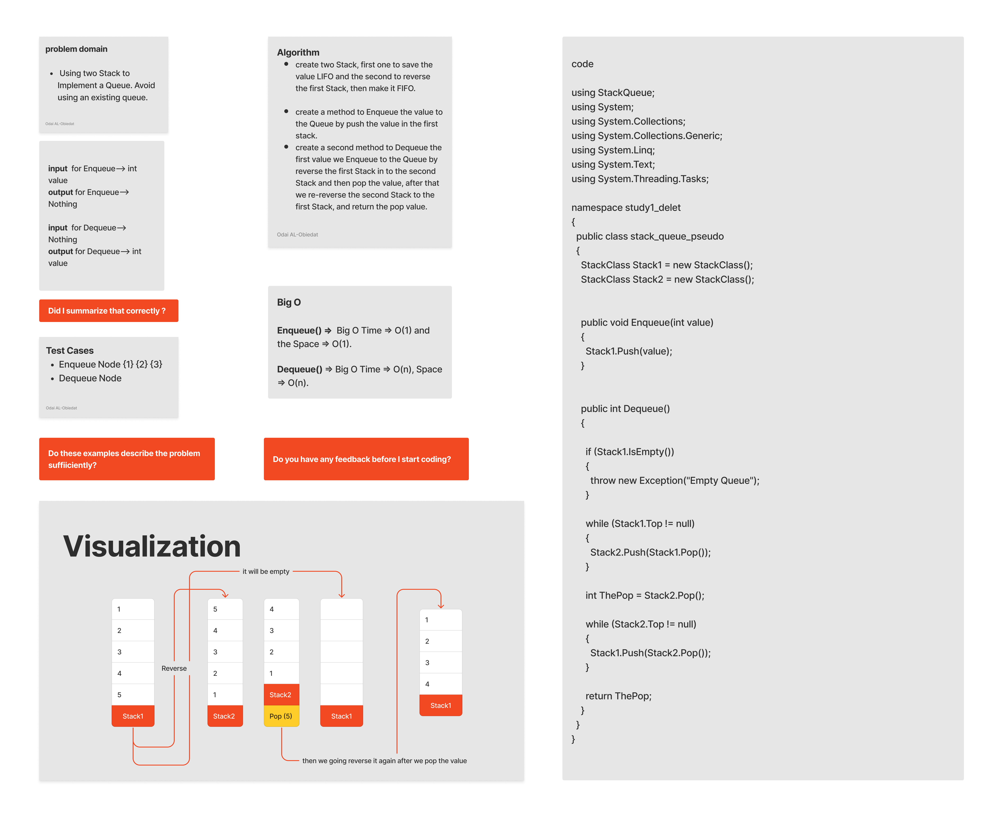

# Queue Pseudo

#### Solution
*[Solution- Queue Pseudo](https://github.com/Ody950/data-structures-and-algorithms/blob/main/DataStructures/DataStructures/stack-queue-pseudo)*

#### Unit Test
*[Unit Test- Queue Pseudo](https://github.com/Ody950/data-structures-and-algorithms/blob/main/DataStructures/DataStructuresTests/StackQueuePseudoTest.cs)*

## Queue Pseudo
We going to Implement a Queue using two Stacks. where the QueuePseudo is a new class that needs to be created. Avoid using an existing queue. However, the QueuePseudo class will only implement the queue interface, and will utilize two stacks internally. The following methods should be used when creating the class:

- enqueue : Adds value to the PseudoQueue on a first-in, first-out basis.

- dequeue : Delete value from the PseudoQueue on a first-in, first-out basis.  

## Stacks

Stacks are data structures made up of nodes. The next Node in the stack is referenced by each Node, but the previous Node is not referenced by any Node, and its LIFO.

- LIFO  : Last In First Out and it means that the Last item added to the stack will be the First item to be popped out of it.

## Queue
Queues are linear structures in which operations follow a defined sequence, and its FIFO.

- FIFO: First In First Out and it means that the First item added to the stack will be the First item to be popped out of it.

# Challenge

 Using two Stack to Implement a Queue. Avoid using an existing queue. However, the QueuePseudo class will only implement the queue interface, and will utilize two stacks internally. The following methods should be used when creating the class:

- enqueue : Adds value to the PseudoQueue on a first-in, first-out basis.

- dequeue : Delete value from the PseudoQueue on a first-in, first-out basis.

# Approach & Efficiency (BigO)

Enqueue() =>  Big O Time => O(1) and the Space => O(1).

Dequeue() => Big O Time => O(n), Space => O(n).

# Whiteboard

## Queue Pseudo

