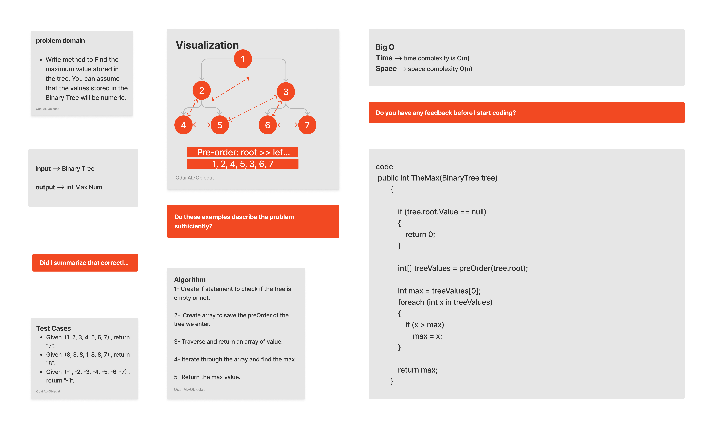

# Trees max

#### Solution
*[Solution- Trees max](https://github.com/Ody950/data-structures-and-algorithms/blob/main/DataStructures/DataStructures/Trees/BinaryTree.cs)*

#### Unit Test
*[Unit Test- Trees max](https://github.com/Ody950/data-structures-and-algorithms/blob/main/DataStructures/DataStructuresTests/treeMaxTest.cs)*

Trees are a powerful data structure with many applications. Trees are used in computer science for various tasks, including storing information, representing hierarchical data, and providing efficient algorithms for operations such as insertion, deletion, and searching.

## Challenge

Write method to Find the maximum value stored in the tree. You can assume that the values stored in the Binary Tree will be numeric.

### Implementing:

- Trees max

## Approach & Efficiency

### Trees max

- Time O(n)
- Space O(n)

# Whiteboard

## Queue Pseudo

