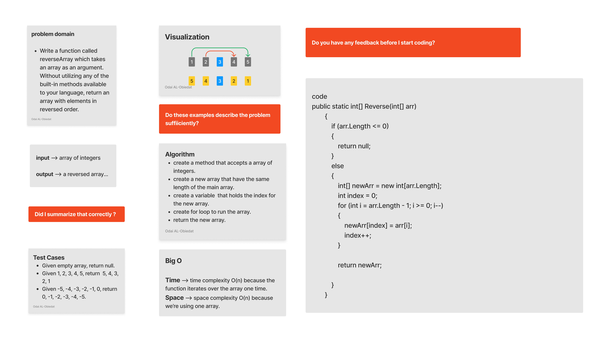

# Data Structures and Algorithms 


*Whiteboard Challenges for Code Fellows seattle401d24*

### Table of contents

  * [Array Data Structure Modules](#array-data-structure-modules)
    * [Challenge 1 Reverse Array](#reverse-array)
    * [Challenge 2 - Insert and Shift Array](#insert-shift-array)
    


Array Data Structure Modules
=====================

<a id="reverse-array"></a>

### Challenege 1 - Reverse Array 


#### Challenge
Write a function called reverseArray which takes an array as an argument. Without utilizing any of the built-in methods available to your language, return the provided array argument with elements in reversed order.

#### Solution
*[Solution](.\c-sharp\DataStructures\CodeChallenges\Code.Challenges1.cs)*



*[Unit Test codecha-1](.\c-sharp\DataStructures\CodeChallengesTests\CodeChallenge-1-Tests.cs)*


<a id="insert-shift-array"></a>

### Challenege 2 - Insert and Shift Array

#### Challenge
Write a function called ```insertShiftArray``` which takes in an array and the value to be added. Without utilizing any of the built-in methods available to your language, return an array with the new value added at the middle index.

#### Solution
*[Solution](https://github.com/justeban/data-structures-and-algorithms/blob/array_shift/array_shift.js/#L1)*


<a id="binary-search"></a>

