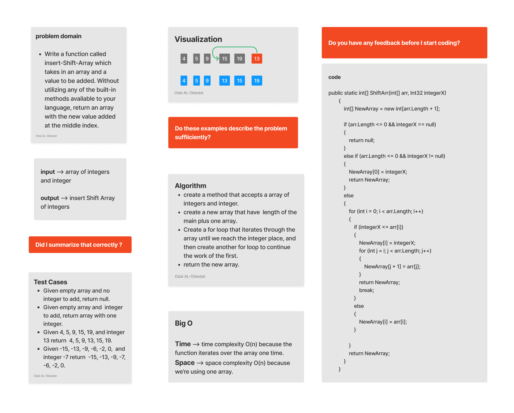
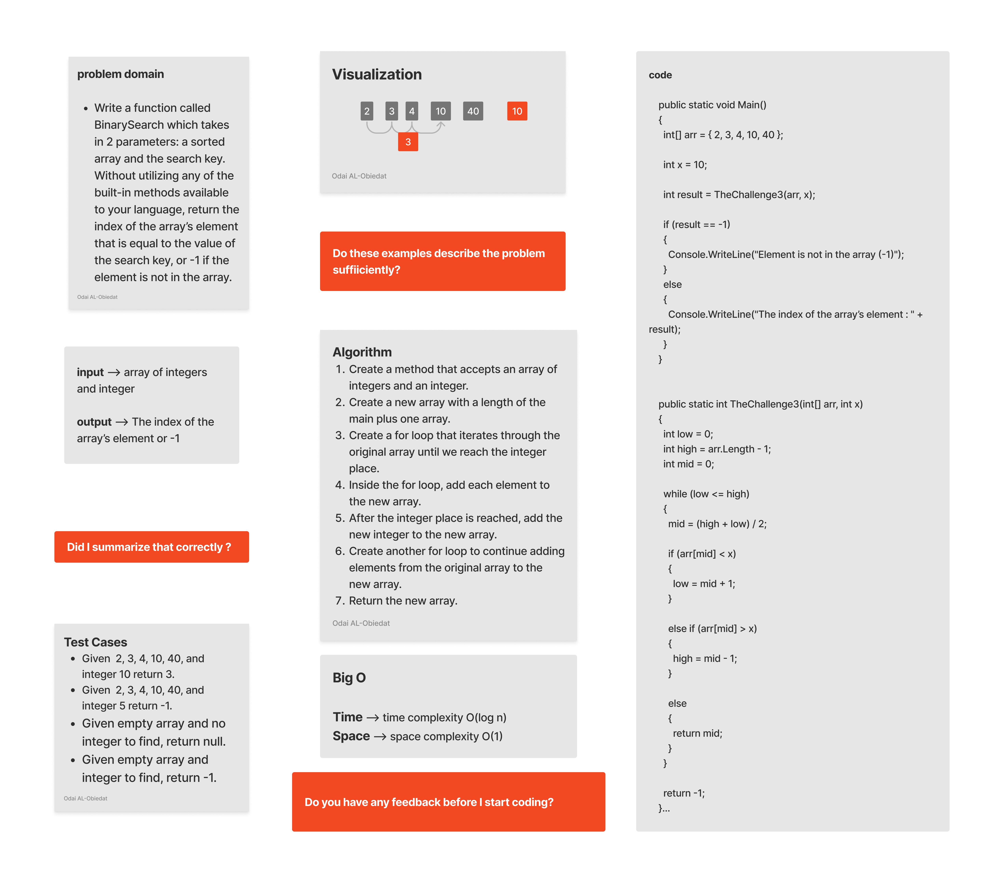

# Data Structures and Algorithms 

*Whiteboard Challenges for Code Fellows seattle401d24*

### Table of contents

  * [Array Data Structure Modules](#array-data-structure-modules)
    * [Challenge 1 Reverse Array](#reverse-array)
    * [Challenge 2 - Insert and Shift Array](#insert-shift-array)
    * [Challenge 3 - BinarySearch](#BinarySearch)
    

Array Data Structure Modules
=====================

### Challenege 1 - Reverse Array 

#### Challenge
Write a function called reverseArray which takes an array as an argument. Without utilizing any of the built-in methods available to your language, return the provided array argument with elements in reversed order.

#### Solution
*[Solution](https://github.com/Ody950/data-structures-and-algorithms/blob/main/c-sharp/DataStructures/CodeChallenges/Code.Challenges1.cs)*

*[Unit Test codecha-1](https://github.com/Ody950/data-structures-and-algorithms/blob/main/c-sharp/DataStructures/CodeChallengesTests/CodeChallenge-1-Tests.cs)*

### Challenege 2 - Insert and Shift Array

#### Challenge
Write a function called insertShiftArray which takes in an array and a value to be added. Without utilizing any of the built-in methods available to your language, return an array with the new value added at the middle index.

#### Solution
*[Solution](https://github.com/Ody950/data-structures-and-algorithms/blob/main/c-sharp/DataStructures/CodeChallenges/Code.Challenges2.cs)*

*[Unit Test codecha-2](https://github.com/Ody950/data-structures-and-algorithms/blob/main/c-sharp/DataStructures/CodeChallengesTests/CodeChallenge-2-Tests.cs)*

### Challenege 3 - Binary Search
#### Challenge
Write a function called BinarySearch which takes in 2 parameters: a sorted array and the search key. Without utilizing any of the built-in methods available to your language, return the index of the array’s element that is equal to the value of the search key, or -1 if the element is not in the array.
#### Solution
*[Solution](https://github.com/Ody950/data-structures-and-algorithms/blob/main/c-sharp/DataStructures/CodeChallenges/Code.Challenges3.cs)*

*[Unit Test codecha-2](https://github.com/Ody950/data-structures-and-algorithms/blob/main/c-sharp/DataStructures/CodeChallengesTests/CodeChallenge-3-Tests.cs)*

